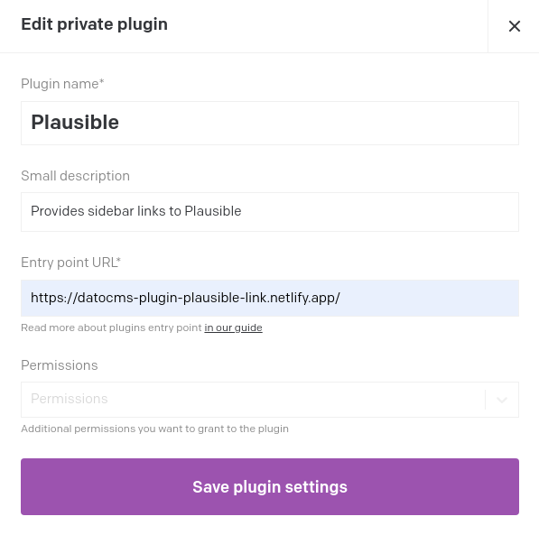
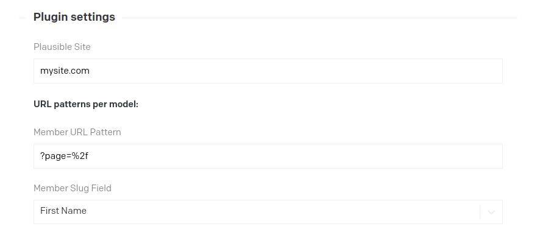
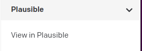

# Plausible DatoCMS Plugin

Datocms plugin that provides a link to plausible for the current record on the sidebar

## Setup

### Adding the plugin from the marketplace

In your DatoCMS project, go to Settings -> Plugins -> Add new (plus sign at the bottom) -> From Marketplace -> Search for Plausible -> Install this plugin.

### Adding as a private plugin

In your DatoCMS project, go to Settings -> Plugins -> Add new (plus sign at the bottom) -> Create new plugin -> Enter the following configuration:

- **Plugin Name:** Plausible

- **Small Description:** Provides sidebar links to Plausible

- **Entry Point URL:** https://datocms-plugin-plausible.netlify.app/

Then click on Save plugin settings

## Plugin parameters

After installing the plugin, in the new settings form we must enter the parameters for our Plausible project.

- **Plausible Site:** The name of our site in plausible,  
  ex: mysite.com

Then for each model, we'll have the following fields:

- **[DATOCMS MODEL] URL Pattern:** The pattern used to construct the Plausible URL for the specified model,  
  ex: ?page=%2f

- **[DATOCMS MODEL] Slug Field:** The field of the specified model that will be used as slug,  
  ex: First Name

The combination of the 3 parameters will be later used by the plugin to create a link, ex:  
https://plausible.io/mysite.com?page=%2fjoakim

Then click on Save Settings

## Plugin

After the setup is complete, we can navigate to content and select a record from one our models.  
The plugin will show up in the sidebar.

## Development

Clone the repo -> `$ yarn install` -> `$ yarn start` -> In your DatoCMS project, settings -> plugins -> Plausible -> Edit private plugin -> Change the Entry Point URL to http://localhost:3000
